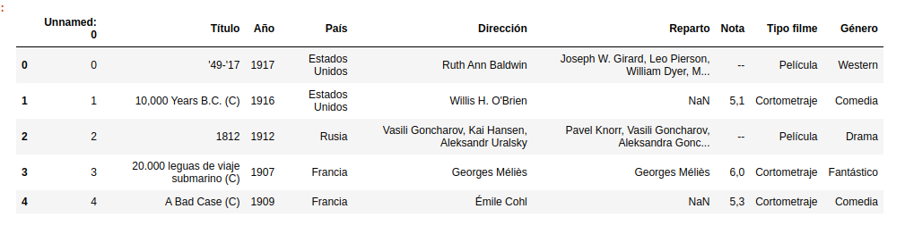
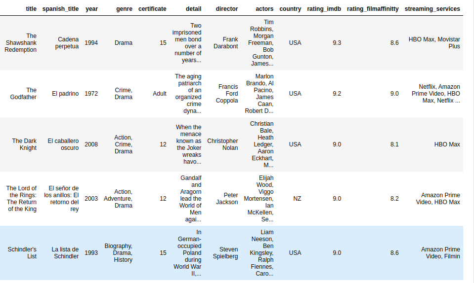

# PROJECTO ETL - RANKING PELÍCULAS 2022

## Índice

 #### 1. [Contexto](#contexto)\
 
 #### 2. [Procedimiento](#procedimiento)\
 
 #### 3. [Resultados ](#resultados)

<a name="Contexto 🎬"/>

## Contexto 🎬

Este proyecto tiene como objetivo la extracción y creación de una base de datos, partiendo de tres fuentes diferentes y aplicando 2 métodos distintos de extracción y por último la exportación de dicha información a una base de datos de SQL.
 

En este caso, se ha analizado una base de datos sobre un ranking de películas según las páginas web `IMDB` y `FilmaAffinitty`, y se ha extraído información complementaria desde la fuente `JustWatch`.

A continuación, el análisis detallado de todo el proceso.

<a name="Procedimiento 🎥"/>

## Procedimiento 🎥

Extracción base de datos IMDB

 

En primer lugar, se ha extraído de la fuente de información `Kaggle`, un archivo csv con las 1000 mejores películas de 2022 según IMDB  y se ha procedido a la limpieza de los datos, eliminando lo que no era relevante, y modificando ciertas columnas para que todas quedaran uniformes.

El resultado final fue el siguiente:

Tras la limpieza de todos los datos, se ha guardado en otro archivo csv, para no perder la información en caso de alguna modificación sin retorno.

 

Web scraping en JustWatch

 

El segundo paso realizdo, fue la puesta en práctica del método web scaping en la página web de `JustWatch` para obtener las diferentes plataformas en las que estaban disponibles las películas anteriores.

Para realizar la búsqueda, se utiliza una librería llamada `Selenium`, que permite controlar un navegador web mediante código. Primero, se establece la URL de la página web y luego se utilizan diferentes métodos de la libreria para interactuar con la página web y automatizar la búsqueda de toda la información requerida.

El resultado final, fue una lista con las diferentes plataformas que se ha añadido al dataframe original como una columna nueva llamada streaming_services.

 

Extracción base de datos FilmAffinitty

 

Para completar el proyecto, se ha extraido una nueva base de datos de la página `Zenodo` donde encontramos un archivo con más de 100.000 películas. En este caso, el objetivo fue unir dicha tabla con la que ya teníamos, para hacer una comparativa entre las notas de IMDB y FilmAffinity, y completar la base de datos final con información faltante en el primer archivo.

Como se puede observar, esta base de datos está en español, por tanto para poder realizar la unión entre ambas, se han tenido que relacionar las columnas, Año, Reparto y Dirección, con las columnas Year, Director y Actors del primer dataframe, ya que el titulo de las películas era diferente por la diferencia de idioma.

Finalmente, se han extraído las columnas que interesaban para el análisis, resultando la base de datos de la siguiente manera:

 

Exportar datos a SQL

 

El último paso, fue exportarlo todo a SQL para obtener la siguiente base de datos:

 

<a name="Resultados 🎞️"/>

## Resultados 🎞️

Como análisis final del proyecto, se han planteado las siguientes propuestas:

- ¿Cuáles fueron las cinco mejores películas?

- ¿Qué seis directores tienen más peliculas en el ranking planteado?

- ¿Qué cinco países tienen más películas dentro del ranking?

